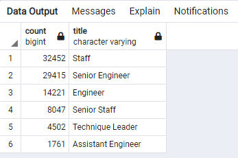
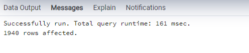

# Pewlett_Hackard_Analysis

## Table of Contents

- [Overview of the analysis](#overview-of-the-analysis)
- [Results](#results)
- [Summary](#summary)

### Overview of the analysis
- In this deliverable, Bobby was entrusted to decide the quantity of resigning workers per title and distinguish representatives who are qualified to take part in a mentorship program. Then, at that point, you'll compose a report that sums up your examination and readies Bobby's administrator for the “silver tsunami”  as numerous current workers arrive at retirement age.

### Results
Furnish a bulleted list with four significant focuses from the two examination expectations:

32,452 Staff
29,415 Senior Engineer
14,221 Engineer
8,047 Senior Staff
4,502 Technique Leader
1,761 Assistant Engineer

### Summary

Provide high-level responses to the following questions, then provide two additional queries or tables that may provide more insight into the upcoming "silver tsunami.":

1) How many roles will need to be filled as the "silver tsunami" begins to make an impact?.

90,398 roles are in urgent need to be filled out as soon as the workforce starts retiring at any given time.

2) Are there enough qualified, retirement-ready employees in the departments to mentor the next generation of Pewlett Hackard employees?

No, we have 1,940 employees who are eligible to participate in a mentorship program.

